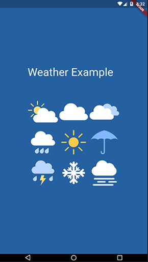
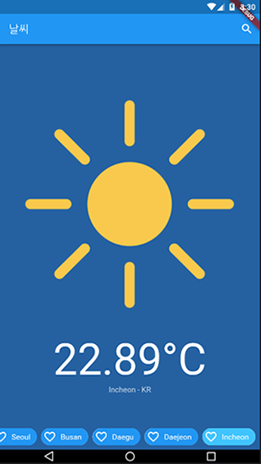
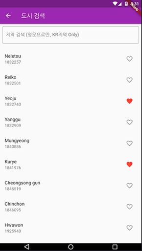

> :octocat: study_flutter_porvider_weather_example
# 플러터 ~ 프로바이더 패턴 사용 날씨 앱 예제

- 홍대 Fultter 스터디에서 flutter로 provier 패턴을 공부하여, [기존 날씨 예제](https://github.com/denlyou/solocoding2019_base)를 수정해 본 소스입니다.

#### [홍대 Fultter 스터디 그룹](https://www.facebook.com/groups/flutterstudy/)